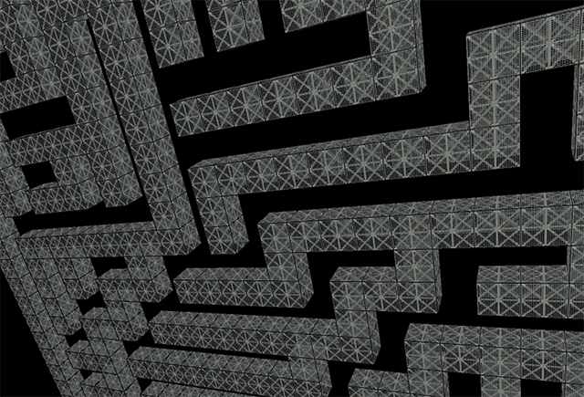

# Binary Maze Demo

Basic binary tree logic test and demo - working on more to come and binary maze library.

## Change Log
  * Binary Tree Exmaple
  * Initial Commit - template.

## Run the example
  Requires Processing v3.3.6 or greater

## License

[MIT]
